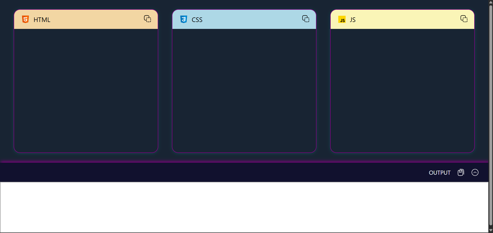

# Live HTML/CSS/JS Code Editor 💻

An in-browser real-time code editor that allows users to write and preview HTML, CSS, and JavaScript instantly. Great for learning and rapid prototyping.

## 🔧 Features
- Separate editors for HTML, CSS, and JavaScript
- Real-time rendering in output window
- Responsive and user-friendly interface

## 🚀 Technologies Used
- HTML, CSS, JavaScript
- Netlify (for deployment)

## 📷 Screenshot

## 🌐 Live Demo
[Visit on Netlify](https://tri-code-editor.netlify.app/)

